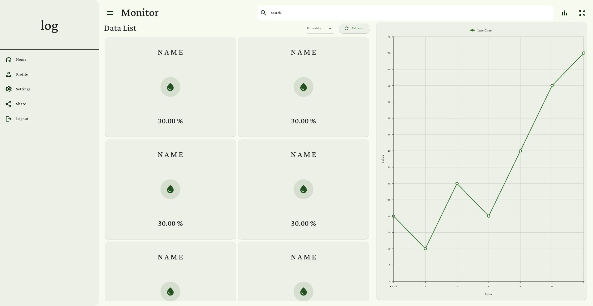
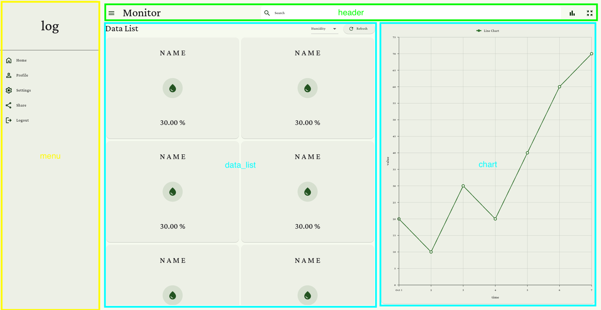

# **mot_ui**

### **项目结构**

```
lib/
├── components/       # 可复用UI组件库
│   ├── chart.dart      # 图表组件
│   ├── data_list.dart  # 数据列表组件
│   ├── header.dart     # 页面顶部标题栏
│   └── side_menu.dart  # 侧边导航菜单
├── core/
│   └── theme/          # 主题配置
│       └── app_theme.dart  
├── main.dart          # 应用入口文件
└── view/
    └── home_page.dart  # 主界面布局实现
```

### **界面结构：**
​	
​	

### **依赖库：**
```
  cupertino_icons: ^1.0.8  # 图标
  google_fonts: ^6.2.1    # 字体
  flutter_svg: ^2.0.17    # svg图片
  syncfusion_flutter_charts: ^28.2.7 # 图表
```